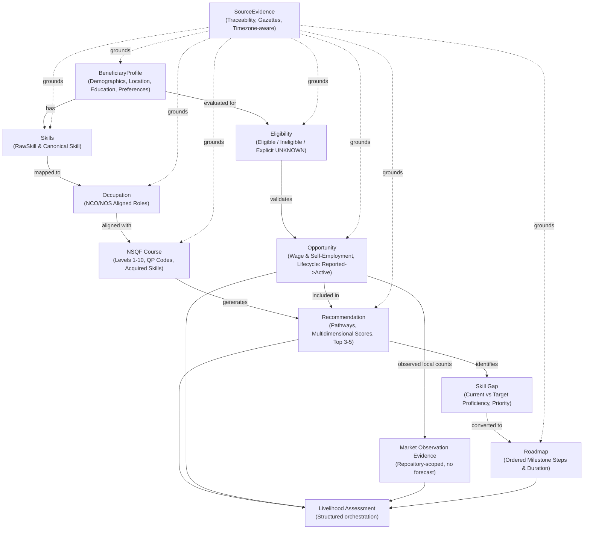
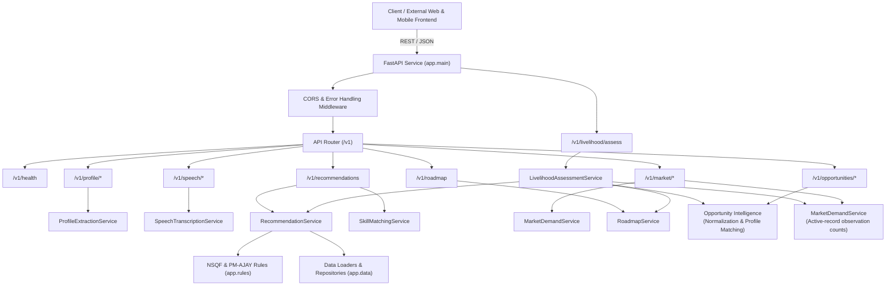

# Architecture Overview

## Project Summary
**Livelihood-Assistant** is an AI-driven, standalone voice and livelihood mapping assistant designed for Scheduled Caste (SC) communities under the **Pradhan Mantri Anusuchit Jaati Abhyuday Yojana (PM-AJAY)**. The service aligns beneficiary aspirations and existing skills with **NSQF (National Skills Qualifications Framework)** levels and local labor market demands.

## Canonical Domain Model Pipeline

The end-to-end livelihood progression and skilling recommendation pipeline is modeled using canonical Pydantic v2 schemas:

## High-Level System Architecture

## Layered Design Principles
1. **Standalone & Decoupled**:
   - Zero hardcoded dependency on other repositories or external MongoDB instances.
   - Any client frontend or administrative backend can consume standard REST APIs.
2. **Canonical Domain Representation**:
   - Explicit `UNKNOWN` state support preventing ungrounded assumptions (e.g., eligibility, baseline proficiencies).
   - Traceable metadata across all entities via timezone-aware `SourceEvidence`.
3. **Contract-First & Type-Safe**:
   - Strictly validated Pydantic v2 domain models with bounds checking (coordinates, scores, NSQF levels 1–10).
4. **Clean Separation of Concerns**:
   - `routes/`: Handles HTTP parameters, status codes, and delegates logic to services.
   - `schemas/`: Defines canonical domain models and API contracts.
   - `services/`: Encapsulates business logic, AI interfaces, and integration adapters.
   - `rules/`: Static standards and policy criteria (NSQF levels, PM-AJAY eligibility).
   - `data/`: Ingestion loaders and repositories without direct DB coupling.
   - `core/`: Environment settings, custom exceptions, and logging configuration.
